# My App Launcher User Guide

A beautiful, native macOS app launcher with group organization, global hotkeys, and a menu bar presence.

---

## Table of Contents
1. [Installation](#installation)
2. [Getting Started](#getting-started)
3. [Menu Bar](#menu-bar)
4. [Global Hotkey](#global-hotkey)
5. [Main Window](#main-window)
6. [Search](#search)
7. [Groups](#groups)
8. [Apps](#apps)
9. [Multi-Select](#multi-select)
10. [Settings](#settings)
11. [Drag and Drop](#drag-and-drop)
12. [Keyboard Shortcuts](#keyboard-shortcuts)

---

## Installation

### From DMG Installer

1. **Download** the `My App Launcher Installer.dmg` file
2. **Double-click** the DMG file to mount it
3. **Drag** "My App Launcher.app" to the **Applications** shortcut
4. **Eject** the DMG by right-clicking it in Finder and selecting "Eject"
5. **Launch** the app from your Applications folder

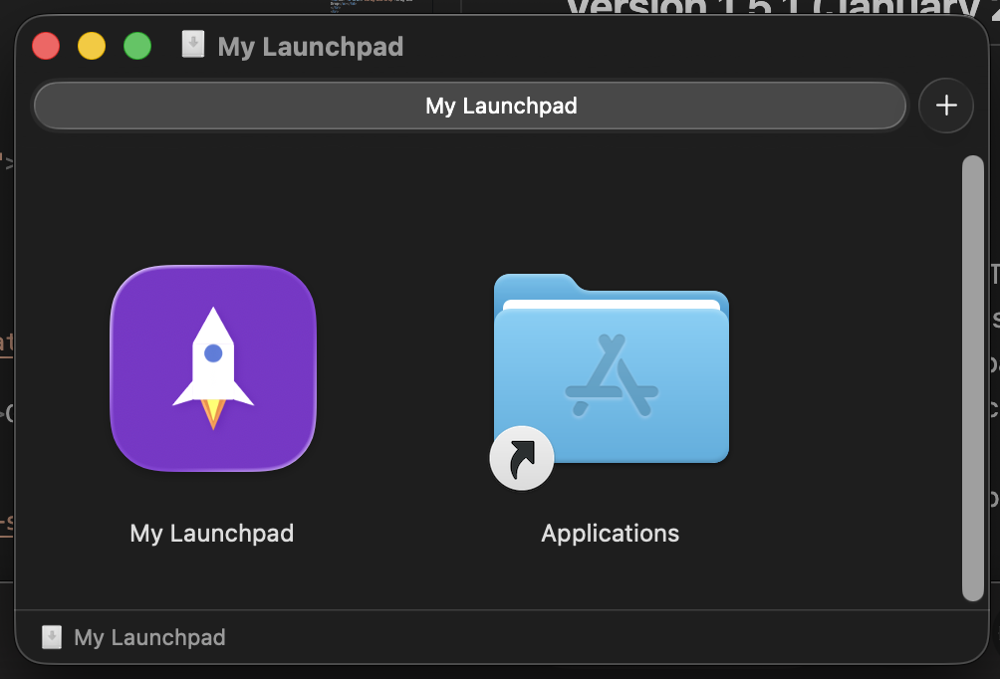

### First-Time Security Prompt

Since this app is not signed with an Apple Developer certificate, macOS will show a security warning on first launch:

#### Method 1: Right-Click to Open
1. Go to your **Applications** folder
2. **Right-click** (or Control-click) on "My App Launcher"
3. Select **"Open"** from the context menu
4. Click **"Open"** in the dialog that appears

#### Method 2: System Settings
1. Try to open the app normally (it will be blocked)
2. Go to **System Settings → Privacy & Security**
3. Scroll down to find the message about "My App Launcher"
4. Click **"Open Anyway"**
5. Enter your password if prompted

### Required Permissions

#### Accessibility Permission (Required for Global Hotkey)
The global hotkey (⌃⌥Space) requires Accessibility permissions:

1. Go to **System Settings → Privacy & Security → Accessibility**
2. Click the **+** button
3. Navigate to **Applications** and select **"My App Launcher.app"**
4. Ensure the toggle is **ON**
5. **Restart the app** after granting permission

> **Important:** If the hotkey stops working after an app update, you may need to remove and re-add the app in Accessibility settings.

### Uninstallation

1. **Quit** the app (click menu bar icon → Quit)
2. **Delete** the app from your Applications folder
3. Optionally remove from **Login Items** in System Settings
4. Optionally remove from **Accessibility** permissions

---

## Getting Started

### First Launch
When you first launch My App Launcher, it will:
- Scan your Applications folder for all installed apps
- Display them in the main window
- Add a grid icon to your menu bar
- Register the global hotkey

### Auto-Start at Login
The app is configured to start automatically when you log in to your Mac. It runs in the background with a menu bar icon, ready to be summoned with the global hotkey.

---

## Menu Bar

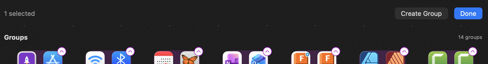

The app displays a **grid icon** (⊞) in your menu bar. Click it to access:

- **Show Launcher (⌃⌥Space)** - Opens the main launcher window
- **Quit** - Completely exits the application

The menu bar icon remains visible even when the main window is closed, indicating the app is running in the background.

---

## Global Hotkey

**⌃⌥Space** (Control + Option + Space)

This hotkey works system-wide to toggle the launcher window:
- Press once to **show** the launcher
- Press again to **hide** the launcher

> **Note:** The app requires Accessibility permissions for the global hotkey to work. Grant access in **System Settings → Privacy & Security → Accessibility**.

---

## Main Window

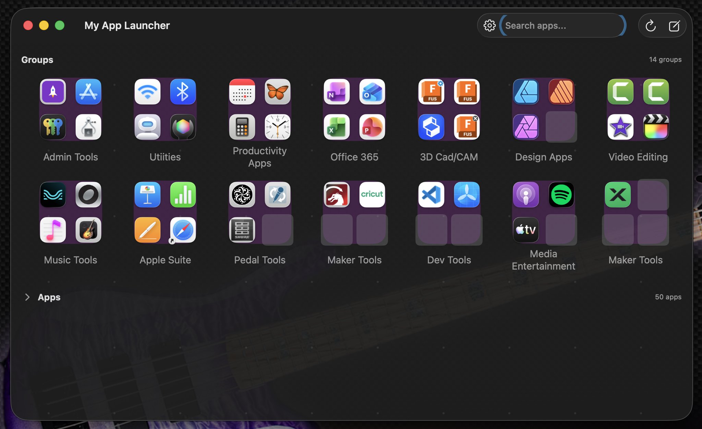

### Window Behavior
- **Red X (Close button)** - Hides the window (app keeps running)
- **Window Transparency** - 95% opacity for a subtle see-through effect
- The window centers on screen when opened

### Sections
The main window has two collapsible sections:

1. **Groups** - Your organized app collections
2. **Apps** - Ungrouped applications (collapsed by default)

Click the section headers to expand/collapse them.

---

## Search

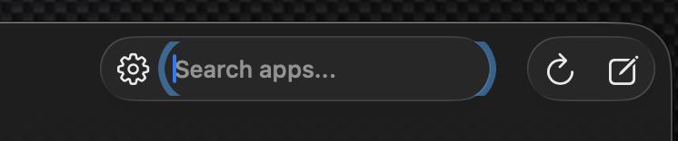

My App Launcher includes a built-in search function to help you quickly find apps.

### Using Search

1. **Locate the Search Bar** - The search bar is located in the toolbar at the top of the main window, next to the settings gear icon
2. **Type to Search** - Simply start typing the name of the app you're looking for
3. **Real-Time Filtering** - Results filter instantly as you type

### How Search Works

- **Case-Insensitive** - Search is not case-sensitive, so "Safari", "safari", and "SAFARI" all work the same
- **Partial Matching** - You can type any part of an app's name to find it (e.g., typing "note" will find "Notes")
- **Searches All Apps** - The search filters both ungrouped apps and apps within groups
- **Groups with Matches** - When searching, groups that contain matching apps will show only those matching apps when expanded

### Clearing Search

To clear your search and show all apps again:
- Delete the text in the search field, or
- Click the X button in the search field (if visible)

> **Tip:** Search is a great way to quickly launch apps without scrolling through your groups. Just press ⌃⌥Space to open the launcher, type a few letters of the app name, and click to launch!

---

## Groups

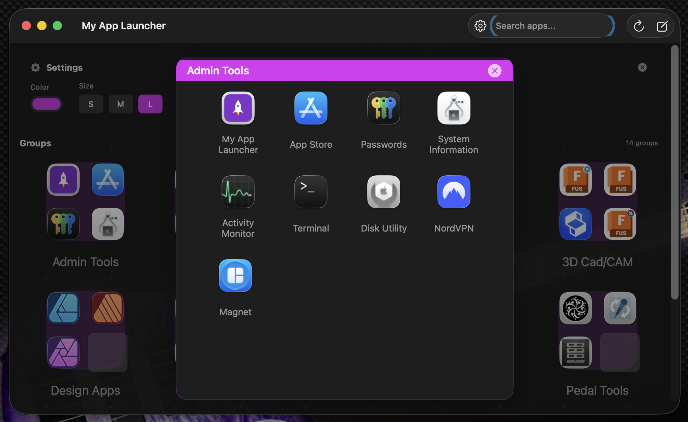

Groups let you organize apps into collections (like iOS folders).

### Creating a Group
1. Enter **Edit Mode** (click the pencil icon or use settings)
2. Select multiple apps
3. Click "Create Group" or right-click and select "Create New Group"

### Group Display Modes

#### Expanded Mode (Default)
Shows a 2x2 preview of the first 4 apps in the group.

#### Collapsed Mode
Shows a folder icon with a badge indicating the number of apps.

Toggle between modes by clicking the chevron button that appears when hovering over a group.

### Opening a Group
Click on a group to open it in an expanded popup view showing all apps inside.

### Renaming a Group
In the group popup, click the group name in the header to edit it.

### Group Popup Features

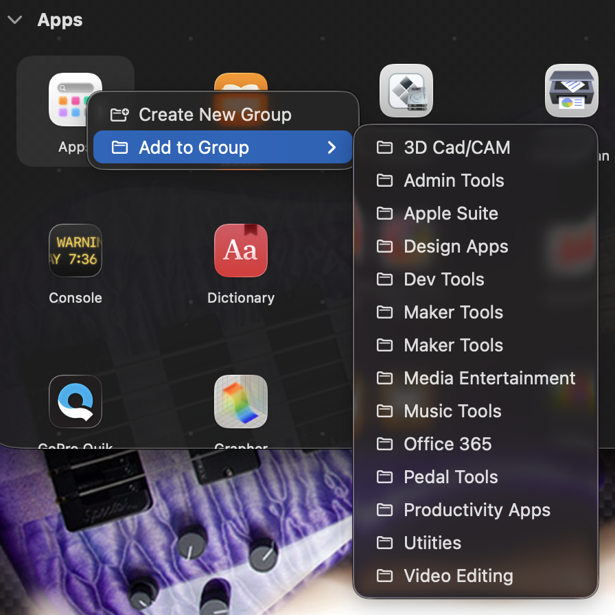

- **Pagination** - Groups with more than 16 apps show multiple pages
- **Page Navigation** - Use arrows or dots at the bottom to navigate pages
- **Swipe Gestures** - Two-finger horizontal swipe on trackpad to navigate between pages
- **Edge Drag Zones** - Drag an app to the left/right edge to flip pages while maintaining the drag
- **Empty Slots** - Moving an app to another page leaves an empty slot (up to 4 per page)
- **Close** - Click the X button or click outside the popup

### Moving Apps Between Pages

When a group has multiple pages, you can move apps between pages using the iPad-style drag interface:

#### Drag to Edge (Recommended)
Drag an app to the **left or right edge** of the group popup window:
- The page will flip after a brief hover (0.4 seconds)
- Continue dragging to position the app anywhere on the new page
- The app fills the first available empty slot, or can be dropped on a specific position
- An empty slot is left on the source page (up to 4 per page)

#### Trackpad Swipe
Use a **two-finger horizontal swipe** on your trackpad to navigate between pages (when not dragging).

#### Drag to Page Dot
Drag an app directly onto a **page indicator dot** at the bottom to move it to that specific page.

#### Context Menu
Right-click an app and select **"Move to Page →"** to choose a specific page.

---

## Apps

### Launching an App
Simply **click** on any app icon to launch it.

### App Context Menu (Right-Click)

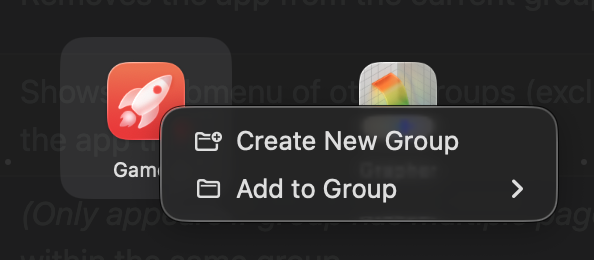

Right-click on any app icon to access a context menu with options that vary based on where the app is located:

#### For Ungrouped Apps (Main Window)

| Option | Description |
|--------|-------------|
| **Create New Group** | Creates a new group containing this app |
| **Add to Group →** | Shows a submenu listing all existing groups (sorted alphabetically). Select a group to add the app to it |

#### For Apps Inside a Group (Group Popup)

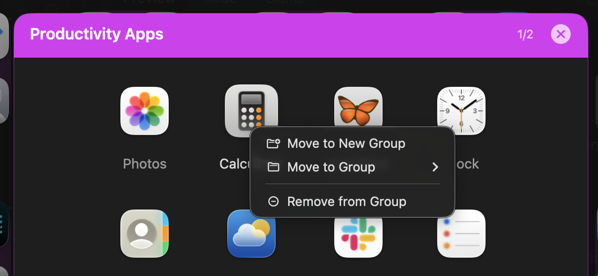

| Option | Description |
|--------|-------------|
| **Move to New Group** | Removes the app from the current group and creates a new group with it |
| **Move to Group →** | Shows a submenu of other groups (excludes current group). Select to move the app there |
| **Move to Page →** | *(Only appears if group has multiple pages)* Move the app to a different page within the same group |
| **Remove from Group** | Returns the app to the ungrouped section |

> **Tip:** The group list in the context menu is sorted alphabetically, making it easy to find the group you want.

### App Icons
- Apps display their native macOS icons

---

## Multi-Select

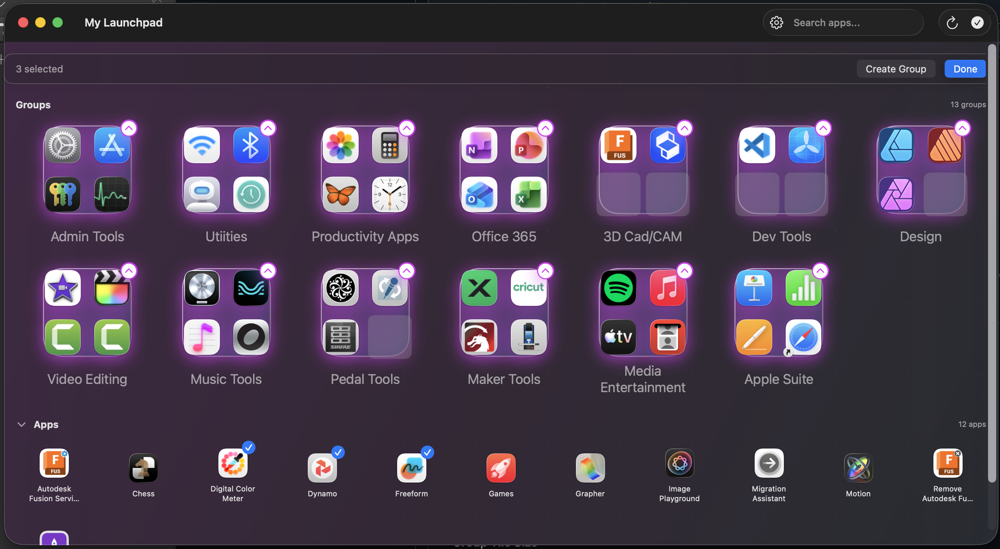

My App Launcher supports selecting multiple apps at once using keyboard modifiers, making it easy to organize many apps quickly.

### Selection Methods

| Action | Result |
|--------|--------|
| **Click** (in edit mode) | Selects only that app, clears other selections |
| **Shift+Click** | Selects all apps from the last selected to the clicked app (range selection) |
| **Command+Click** | Toggles the clicked app without affecting other selections |

### How to Use Multi-Select

1. **Enter Edit Mode** - Long-press on any app or use the edit button
2. **Select Apps**:
   - Click the first app you want to select
   - **Shift+Click** another app to select the entire range between them
   - **Command+Click** to add or remove individual apps from your selection
3. **Perform Actions** - Right-click on any selected app to:
   - Create a new group with all selected apps
   - Add all selected apps to an existing group

### Tips

- Selected apps show a blue checkmark overlay
- The selection works in the main Apps section (ungrouped apps)
- Use Shift+Click for selecting many consecutive apps quickly
- Use Command+Click for picking specific apps scattered throughout the list
- Icons scale based on the group tile size setting
- Hovering over an app shows a subtle highlight effect

---

## Settings

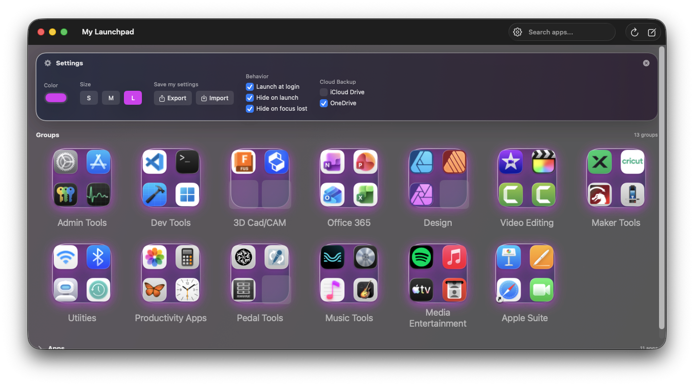

Access settings by clicking the **gear icon** in the top-right corner.

### Available Settings

#### Group Header Color
Choose the color for group popup headers using the color picker. Default is purple.

#### Group Tile Size
Select the size of group tiles:
- **S** (Small) - 0.8x scale
- **M** (Medium) - 1.1x scale (default)
- **L** (Large) - 1.3x scale

#### Save My Settings
Use the Export and Import buttons to back up and restore your launcher configuration.

**Export** - Save all your launcher settings to a JSON file. This includes:
- All groups and their names
- App organization within groups
- Ungrouped app order

Use this to:
- Back up your configuration
- Transfer settings to another Mac
- Share your setup with others

**Import** - Restore settings from a previously exported file. The import process:
- Matches apps by their file path on your system
- Recreates your groups with the same names and organization
- Any apps that no longer exist on your system will be skipped
- New apps not in the imported settings will appear in the ungrouped section

> **Note:** Importing will replace your current groups and organization with the imported settings.

---

## Drag and Drop

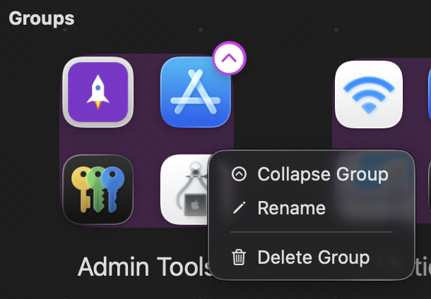

### Adding Apps to Groups
Drag an app onto a group icon to add it to that group.

### Reordering Apps Within a Group
In the group popup:
- **Drop ON an app** - Inserts at that position, pushing other apps forward
- **Drop to the LEFT of an app** - Inserts before that app
- **Drop to the RIGHT** - Inserts after (at end of row or end of list)
- **Drop on empty slot** - Places the app in that empty position

### Moving Apps Between Pages
In multi-page groups:
- **Drag to edge** - Flip to prev/next page while continuing to drag
- **Drop anywhere** - App fills first empty slot or drops at position
- **Empty slot left behind** - Source page keeps an empty slot (up to 4)

### Reordering Groups
On the main screen:
- **Drop ON a group** - Swaps positions with that group
- **Drop to the LEFT of a group** - Inserts before that group
- **Drop to the RIGHT of a group** - Inserts after that group

### Moving Apps Between Groups
Use the context menu to move apps between groups, or drag from ungrouped to a group.

---

## Keyboard Shortcuts

| Shortcut | Action |
|----------|--------|
| **⌃⌥Space** | Toggle launcher window (global) |
| **⌘⇧N** | Create new group |
| **⌘Q** | Quit application |

---

## Tips & Tricks

1. **Quick Access** - Use ⌃⌥Space from anywhere to instantly open the launcher
2. **Stay Organized** - Group related apps together (e.g., "Development", "Design", "Games")
3. **Collapse Groups** - Use collapsed mode for groups you access less frequently
4. **Search** - Use the search bar to quickly find apps by name

---

## Troubleshooting

### Hotkey Not Working
1. Check **System Settings → Privacy & Security → Accessibility**
2. Ensure "My App Launcher" is listed and enabled
3. Try removing and re-adding the app to the list
4. Restart the app after granting permissions

### App Not Starting at Login
1. Go to **System Settings → General → Login Items**
2. Add "My App Launcher.app" from the Applications folder

### Missing App Icons
If an app shows a blank icon:
1. The app may have been moved or deleted
2. Try refreshing the app list (relaunch My App Launcher)

---

## System Requirements

- **macOS 13.0** (Ventura) or later
- Accessibility permissions for global hotkey

---

## Version History

### v1.3.0 (January 2026)
- Multi-select support with Shift+Click and Command+Click
- Persistent group tile size setting
- "Remove from Group" context menu option
- Improved group popup height for 16-app groups
- Sequential grid layout (no gaps in middle of pages)

### v1.2.0 (January 2026)
- Internal release with bug fixes

### v1.1.0 (January 2026)
- iPad-style multi-page navigation with edge drag zones
- Trackpad swipe gestures for page navigation
- Empty slot preservation when moving apps between pages
- Enlarged and improved group popup header
- Cleaner drop zone visuals (transparent until activated)
- Fixed app icon not appearing in Finder
- Fixed settings persistence for app layouts

### v1.0.0
- Initial release
- Group organization with collapsible tiles
- Global hotkey support (⌃⌥Space)
- Menu bar presence
- Drag and drop reordering
- Customizable group colors and sizes
- Window transparency
- Auto-start at login

---

*My App Launcher - A better way to launch your apps.*
